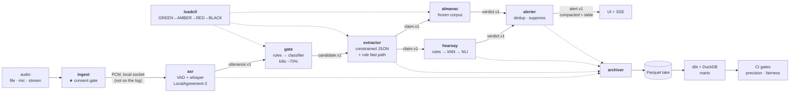

# BLAH — Bullshit Live Analysis Harness

**A streaming pipeline that turns live speech into tracked claims and tells you when a speaker
contradicts themselves — with both quotes, both timestamps, and the audio, in under four
seconds.**

```
00:03:12  "I ran our Kafka estate for about four years at Acme —
           three clusters, I was the one paged when it broke."

00:21:47  "...to be fair I've never actually operated Kafka myself,
           we had a platform team that owned all of that."

00:21:50  ⚠  POSSIBLE CONFLICT — direct operational experience, Kafka
             ▶ 00:03:12    ▶ 00:21:47      verdict lag 2.8s
```

> *"It is impossible for someone to lie unless he thinks he knows the truth. Producing bullshit
> requires no such conviction."* — Harry G. Frankfurt, *On Bullshit* (2005)

The name is the thesis. A **liar** tracks the truth in order to move away from it; a
**bullshitter** is simply indifferent to it — and someone indifferent to truth does not bother to
stay consistent with themselves. **Self-contradiction is the observable signature of indifference
to truth**, and unlike "is this statement false?", it is a closed-world problem we can actually
solve. BLAH is a consistency detector, not a lie detector.

---

## Quickstart

No GPU. No API keys. No accounts. No model downloads.

```bash
git clone <repo> && cd blah && make demo
```

Opens `http://localhost:8080` and plays a recorded mock interview end to end. You should see one
alert, with two quotes and two play buttons, within four seconds of the contradicting sentence.

```bash
make demo          # the full pipeline on a recorded fixture
make chaos-kill-asr   # kill transcription mid-stream; watch it recover, lose nothing
make load-4x          # overload it; watch it degrade in a defined order
make replay && make diff   # re-run under a new version and diff the results
make verify-m0        # every "done means" line, checked
```

---

## What this is

A portfolio project by two people — a **data engineer** and a **DevOps engineer**, both junior,
neither an ML researcher. Every model in it is off-the-shelf and frozen. **We trained nothing.**

**The AI is three stages. The pipeline is the project.** If you deleted every model and replaced
them with `input()` calls, ~80% of this repo would still be here and still be hard:

- **Where do you cut?** Speech is continuous; claims are discrete records needing a primary key.
- **What do you drop** when verification is 20–50× slower than transcription — and how do you
  tell the user what you dropped?
- **How does one claim, said three times, produce one alert** rather than three?
- **A verdict arrives after the speaker moved on.** Event time vs processing time.
- **How do you prove a change made it better** instead of just different?
- **What must you refuse to build**, when the ASR underneath you has a ~2× word-error-rate gap
  between demographic groups?

The proof that this is the real content: **milestone M0 contains no machine learning at all.**
Fake transcription, rule-based contradiction detection — and a real log, real replay, real
consent gate, real dashboards, real CI. Models were swapped in afterwards behind contract-tested
interfaces.

---

## Architecture



Everything runs on **Redpanda** (Kafka API), **Postgres + pgvector**, **MinIO**, **DuckDB**, with
**Prometheus / Grafana / OpenTelemetry**, in **Docker Compose** or **k3d + KEDA**.

**Latency budget, p95, target 4,000 ms:**

| capture | VAD wait | ASR | gate | extract | retrieve+NLI | verdict | deliver | **total** |
|---|---|---|---|---|---|---|---|---|
| 250 | 700 | 1,200 | 50 | 1,000 | 110 | 20 | 100 | **3,430 ms** |

Deterministic fast path (rule-detected contradiction, no LLM): **~2,360 ms**. The most confident
alerts are also the fastest.

---

## What's interesting here, and where to look

| If you care about | Look at |
|---|---|
| **Whether the scope is honest** | [ADR-001](docs/01-DECISIONS.md#adr-001-scope--internal-consistency-is-the-core-external-checking-is-a-bounded-second-verifier) — we judged our own premise ("both modes are the same pipeline") and found it ~70% true, then said which 30% isn't and why it matters |
| **Streaming design under a real budget** | [ADR-006](docs/01-DECISIONS.md#adr-006-the-latency-budget) — the budget, and the seven architectural decisions that fall out of it rather than being chosen independently |
| **Backpressure done properly** | [ADR-009](docs/01-DECISIONS.md#adr-009-backpressure-and-shedding) — priority shedding where **every shed claim still gets a verdict record**, so "not checked" is never rendered as "checked and clear" |
| **Idempotency** | [ADR-011](docs/01-DECISIONS.md#adr-011-claim-identity-and-idempotent-alerting) — three identifiers doing three different jobs; conflating them *is* the bug |
| **Why not just use an LLM / RAG** | [ADR-012](docs/01-DECISIONS.md#adr-012-how-contradiction-is-actually-detected) — contradictory sentences are *highly similar* in embedding space, so similarity is a good retrieval signal and a terrible decision signal |
| **Ethics that are architecture, not prose** | [ADR-016](docs/01-DECISIONS.md#adr-016-bounding-asr-bias-so-it-cannot-become-a-discrimination-engine) — there is **no field in the `Alert` schema that could hold a candidate score**, and CI fails if the WER gap between speaker groups exceeds 1.5× |
| **Why there's a warehouse at all** | [ADR-018](docs/01-DECISIONS.md#adr-018-why-there-is-a-batch-warehouse-at-all) — four questions the hot path genuinely cannot answer |
| **Tools we refused** | [`04-STACK.md`](docs/04-STACK.md#deliberately-not-adopted) — no Airflow, no Flink, no vector DB, with the threshold at which each becomes correct |
| **Two people, no manager** | [`08-WAYS-OF-WORKING.md`](docs/08-WAYS-OF-WORKING.md) — a co-owned `contracts/` package, CODEOWNERS requiring both approvals, and game days with committed incident write-ups |

### Three things we chose *not* to build

1. **No candidate scoring.** ASR word error rates differ ~2× across demographic groups. An
   automated screening score built on that is a discrimination engine with a dashboard. BLAH
   emits prompts for a human interviewer, and the schema has no field that could carry a score.
2. **No `FALSE` verdict.** The enum does not contain it. The strongest thing BLAH will say is that
   a statement conflicts with a named source, as of a date, with a link.
3. **No live web retrieval.** It would add 0.5–2 s of variance to the hot path and make replay
   non-reproducible. The reference corpus is frozen and versioned.

---

## Prior art

We are not the first. [LiveFC](https://arxiv.org/html/2408.07448v2) (WSDM 2025) is
near-identical in topology — with no public code and **no published latency numbers**.
[Squash](https://reporterslab.org/2021/06/28/the-lessons-of-squash-our-groundbreaking-automated-fact-checking-platform/)
(Duke Reporters' Lab, 2019–21) shipped, failed, and wrote an honest post-mortem: the pipeline
worked fine; it died of **data** problems. Every failure they documented maps to a decision in
[`01-DECISIONS.md`](docs/01-DECISIONS.md).

**Nobody in this space has published a replay harness, per-stage SLOs, a shedding policy, a
failure-injection story, or an idempotent alerting model — and nobody does intra-session
contradiction tracking at all.** That gap is the project, and it is a data engineering and SRE
gap rather than a machine learning one.

---

## Documentation

| File | What |
|---|---|
| [`00-PITCH.md`](docs/00-PITCH.md) | Pitch, buyers, prior art, non-goals, assumptions |
| [`01-DECISIONS.md`](docs/01-DECISIONS.md) | **22 ADRs. The most important file here.** |
| [`02-ARCHITECTURE.md`](docs/02-ARCHITECTURE.md) | Topology, stream vs table vs batch, latency budget, 15 failure modes |
| [`03-DATA-CONTRACTS.md`](docs/03-DATA-CONTRACTS.md) | Schemas, the `Claim` lifecycle, partitioning, PII |
| [`04-STACK.md`](docs/04-STACK.md) | Every tool, two rejected alternatives each, and how we'd run without it |
| [`05-ROADMAP.md`](docs/05-ROADMAP.md) | M0–M6, each independently demo-able, plus an ordered cut list |
| [`06-EVALUATION-AND-RISK.md`](docs/06-EVALUATION-AND-RISK.md) | Gold sets, metrics, and every risk with the code that mitigates it |
| [`07-DEMO-AND-INTERVIEW.md`](docs/07-DEMO-AND-INTERVIEW.md) | The 3-minute script and 10 panel questions |
| [`08-WAYS-OF-WORKING.md`](docs/08-WAYS-OF-WORKING.md) | How two people work on this without blocking each other |

**Status: design complete, implementation not started.** M0 is the next thing to build.

## Licence and ethics

Code MIT. No third-party audio is redistributed — `fixtures/` holds transcripts and a fetch
script. The default demo fixture is recorded by us. **A session cannot be started without a valid
consent manifest, and there is no bypass flag.**
