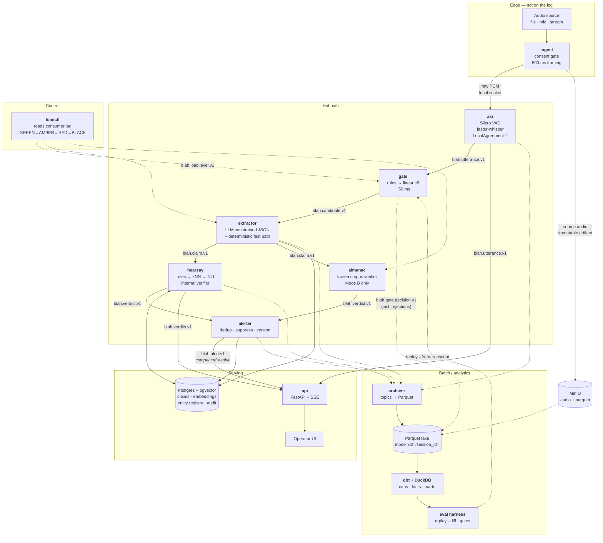
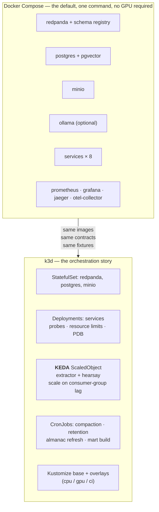

# Architecture

Components, boundaries, topology, the latency budget as a live thing, and what happens when
each piece breaks.

Every decision here is justified in [`01-DECISIONS.md`](01-DECISIONS.md). This file describes
*what was built*; that file describes *why*. If they disagree, that file wins.

---

## The shape in one sentence

Audio enters through a consent-gated ingest, becomes confirmed utterances, is filtered by a
cheap gate, is turned into structured claims, is joined against the speaker's own prior claims
to detect contradiction, and emerges as deduplicated alerts — with every stage's records
landing durably on a log that is also the replay and evaluation substrate.

---

## Streaming topology



**Dotted edges are off the hot path.** Nothing dotted can affect the latency budget.

### Why audio is not on the log

`ingest` sends raw PCM to `asr` over a **local socket, not through the broker.** 16 kB/s of
PCM per session would dominate broker IO and buy nothing: the source audio is already
persisted as an immutable object for replay, and no other consumer wants frames. **The log
starts at `blah.utterance.v1`.** This is the single most common over-application of Kafka and
we avoid it deliberately. See [ADR-007](01-DECISIONS.md#adr-007-the-transport--redpanda-not-kafka-not-nats-not-http).

---

## Data flow and the three storage layers

```mermaid
flowchart LR
    subgraph L1["HOT — Postgres + pgvector"]
        direction TB
        H1["claims (current session)"]
        H2["claim_embeddings — IVFFlat"]
        H3["entity_registry"]
        H4["alerts — current state"]
        H5["audit_log — append only"]
    end

    subgraph L2["LAKE — Parquet on MinIO"]
        direction TB
        K1["utterance/ dt= session_id="]
        K2["claim/ · verdict/ · alert/"]
        K3["gate_decision/"]
        K4["audio/ — immutable source"]
    end

    subgraph L3["MARTS — dbt on DuckDB"]
        direction TB
        M1["dim_session · dim_speaker<br/>dim_pipeline_version · dim_almanac_source (SCD2)"]
        M2["fct_claim · fct_verdict<br/>fct_alert · fct_stage_latency"]
        M3["mart_precision_by_version<br/>mart_wer_by_group<br/>mart_latency_percentiles<br/>mart_shed_rate"]
    end

    LOG[("Redpanda<br/>blah.*.v1")] -->|"serving consumers<br/>milliseconds"| L1
    LOG -->|"archiver<br/>micro-batch"| L2
    L2 -->|"dbt build"| L3
    L3 -->|"CI quality + fairness gates"| CI["GitHub Actions<br/>blocks the merge"]
    L3 -->|"threshold tuning"| HUMAN["Us, reading numbers<br/>instead of guessing"]
    L1 -.->|"GDPR erase<br/>propagates"| L2
    L2 -.-> L3
```



### What is a stream, what is a table, what is a batch job

This distinction is not academic here; it determines cleanup policy, and getting it wrong
either loses data or grows forever.

| Thing | Kind | Why | Physical form |
|---|---|---|---|
| `blah.utterance.v1` | **Stream** | An immutable fact: *this was said at this media time*. Never revised (a diarization correction is a **new** record). | Append-only topic, 7 d retention |
| `blah.gate.decision.v1` | **Stream** | Immutable decisions, including rejections. Rejections are the only way to measure gate recall. | Append-only, 7 d |
| `blah.candidate.v1` | **Stream** (internal) | A work queue. Nobody reads it twice. | Append-only, 24 h |
| `blah.claim.v1` | **Stream** | An extracted claim is immutable. A re-extraction under a new `run_id` is a different record. | Append-only, 7 d |
| `blah.verdict.v1` | **Stream** | A claim may receive several verdicts over time (fast rule now, deep check later). Each is a fact about a moment. | Append-only, 7 d |
| `blah.alert.v1` | **TABLE** | An alert has genuinely **mutable state**: `restated_count`, confidence upgrades, suppression window. The topic is its changelog. | **Compacted**, keyed by `alert_id`, infinite |
| `blah.load.level.v1` | **Stream** | Controller transitions, so replay reproduces the same degradation. | Append-only, 7 d |
| `entity_registry` | **Table** | Current known subjects per session. Derived purely from claims — rebuilt by query on restart, never snapshotted. | Postgres |
| `dim_almanac_source` | **Table, SCD2** | A source's stated fact changes over time; a verdict must be judged against what the source said **then**. `valid_from`/`valid_to`/`as_of`. | DuckDB |
| Mart builds, compaction, retention deletion, Almanac refresh, eval runs | **Batch** | Aggregate over many sessions and many runs. Not answerable from a stream. | Python CLI + dbt, cron/CronJob |

`blah.alert.v1` being a compacted changelog while everything upstream is append-only is the
cleanest illustration of the distinction in the system, and it is functional rather than
decorative: the UI materialises the compacted topic to get current alert state after a reload.

---

## Component boundaries

Ownership per [ADR-021](01-DECISIONS.md#adr-021-two-people-one-co-owned-interface).
**A** = data engineer, **B** = DevOps engineer, **AB** = co-owned, needs both approvals.

| Component | Owner | Responsibility | Consumes | Produces | Stateful? |
|---|---|---|---|---|---|
| `contracts` | **AB** | Schemas, enums, topic names, `ASR`/`Verifier`/`Extractor` interfaces, fakes, contract tests | — | — | No |
| `ingest` | B | **Consent gate (refuses without a valid manifest)**, audio capture, 500 ms framing, source archival | Audio, session manifest | PCM socket, audio object | No |
| `asr` | A→B | VAD endpointing, faster-whisper, LocalAgreement-2, word timings + confidence | PCM socket | `utterance.v1` | Yes — audio buffer (rebuildable) |
| `gate` | A | Two-stage check-worthiness, load-aware threshold | `utterance.v1`, `load.level.v1` | `candidate.v1`, `gate.decision.v1` | No |
| `extractor` | A | Windowed claim extraction, canonicalisation, fingerprinting, embedding | `candidate.v1` | `claim.v1`, Postgres writes | Reads registry |
| `hearsay` | A | **The engine.** Rules → kNN retrieval → NLI rescoring, internal + reference-doc verification | `claim.v1` | `verdict.v1` | Yes — session claim store |
| `almanac` | A | Mode B verification against the frozen corpus | `claim.v1` | `verdict.v1` | Reads Almanac |
| `alerter` | A | Dedup by key, suppression, versioning, severity downgrade rules | `verdict.v1` | `alert.v1` | Yes — alert state |
| `loadctl` | B | Reads consumer-group lag, drives GREEN/AMBER/RED/BLACK | Broker metrics | `load.level.v1` | Yes — current level |
| `api` | B | SSE fan-out, session control, audio serving, subject export/erase | `utterance`, `verdict`, `alert` | HTTP/SSE | No |
| `archiver` | B | Topics → Parquet, idempotent, deterministic filenames + atomic rename | All topics | Parquet in MinIO | Offsets only |
| `warehouse` | A (models) / B (jobs) | dbt marts; compaction, backfill, retention deletion | Parquet | DuckDB marts | No |
| `eval` | A | Replay, diff, metrics, gold-set tooling, CI gates | Lake + marts | Reports | No |

**Every stateful component's state is rebuildable from the log or from Postgres.** No component
holds authoritative state only in memory. That is what makes "kill it mid-stream" a demo rather
than an incident.

---

## The latency budget, live

The budget from [ADR-006](01-DECISIONS.md#adr-006-the-latency-budget), reproduced because it is
the number the architecture is built around. **p95 target: 4,000 ms** from
`utterance.media_end` to alert rendered. Every figure is an estimate until M1/M2 measure it on
our hardware.

```mermaid
gantt
    title Latency budget — GPU profile, p95 estimates (ms)
    dateFormat X
    axisFormat %L
    section Capture
    frame buffering 250          :0, 250
    VAD endpoint wait 700        :250, 950
    section Transcribe
    ASR LocalAgreement 1200      :950, 2150
    section Understand
    gate 50                      :2150, 2200
    claim extraction 1000        :2200, 3200
    section Verify
    embed + kNN 30               :3200, 3230
    NLI rescore 80               :3230, 3310
    verdict + dedup 20           :3310, 3330
    section Deliver
    SSE + render 100             :3330, 3430
    HEADROOM 570                 :3430, 4000
```



| Stage | Budget | Owner | Instrumented as |
|---|---|---|---|
| Frame buffering | 250 ms | B | `blah_ingest_frame_latency_ms` |
| VAD endpoint wait | 700 ms | A | `blah_asr_endpoint_wait_ms` |
| ASR confirmed text | 1,200 ms | A | `blah_asr_confirm_latency_ms` ← **weakest estimate, measured M1** |
| Gate | 50 ms | A | `blah_gate_latency_ms` |
| Claim extraction | 1,000 ms | A | `blah_extract_latency_ms` ← **highest variance, measured M2** |
| Embed + kNN | 30 ms | A | `blah_retrieve_latency_ms` |
| NLI rescore | 80 ms | A | `blah_nli_latency_ms` |
| Verdict + dedup | 20 ms | A | `blah_verdict_latency_ms` |
| SSE + render | 100 ms | B | `blah_delivery_latency_ms` |
| **End to end** | **3,430 ms** | — | `blah_verdict_lag_ms` ← **SLO-3** |

**Fast path** (deterministic numeric/polarity contradiction; LLM skipped entirely): **~2,360 ms.**
The most confident alerts are also the fastest — that is by design, not luck.

A single **OpenTelemetry trace spans all of it**, with trace context propagated in Kafka
headers, so this table is a live Jaeger waterfall rather than a document. Distributed tracing
across an async streaming pipeline is the non-trivial version of tracing, and it is what makes
per-stage regressions visible rather than inferred.

---

## Failure modes

What breaks, how we detect it, how the system degrades, and what the user sees. **Every row is
either injectable via `make chaos-*` or asserted in a test.**

| # | Failure | Detection | Degradation | What the user sees |
|---|---|---|---|---|
| 1 | `asr` crashes mid-stream | SLO-1 ingest completeness drops; `utterance_lag` spikes | Restarts, resumes from committed offset. Buffered audio re-read from the source artifact. | "Transcription interrupted" banner; transcript resumes. **Zero claim loss**, proven by SLO-4's conservation check. |
| 2 | `extractor` too slow / GPU contended | Consumer lag on `candidate.v1`; SLO-3 burn | `loadctl` → AMBER (raise gate threshold) → RED (deterministic fast path only) → BLACK (shed by priority) | Lower-priority utterances marked **"not checked — system busy"**. Never silent. |
| 3 | Ollama unavailable | Health probe fails; extraction errors | Automatic `--no-llm`: rule-based extraction, Stage A contradiction only | Fewer claims, all high precision. Degraded-mode badge shown. |
| 4 | Broker unavailable | Producer errors; all lag metrics stale | `ingest` buffers to local disk; `asr` continues; hot path stalls at the first produce | "Pipeline degraded"; transcript continues, verdicts pause and arrive late as `SETTLED`. |
| 5 | Postgres unavailable | Connection pool errors | `hearsay` cannot retrieve prior claims → emits `UNVERIFIED / NO_REFERENCE_COVERAGE` rather than guessing | Explicit "could not check" markers. **We never render silence as clear.** |
| 6 | Disk full (lake) | `archiver` write failures; disk metric | Archiver fails loudly and stops; **hot path unaffected** | No user-visible change. Ops alert fires. Replay/eval degraded until fixed. |
| 7 | Diarization mislabels speakers | Speaker-churn metric; `speaker_id` revision rate | Claims attributed to the wrong cluster → **false contradictions** | **The dangerous one.** Mitigated by requiring speaker stability over N utterances before a claim may alert across a speaker boundary. |
| 8 | ASR confidence low (accent, noise) | Per-word confidence below threshold | `flags.low_asr_confidence` → alert **downgraded to annotation** ([ADR-016](01-DECISIONS.md#adr-016-bounding-asr-bias-so-it-cannot-become-a-discrimination-engine)) | Quiet margin note, no alarm. |
| 9 | Extractor emits an unresolved referent | `flags.subject_unresolved` rate | Claim stored, counted, **never alerts**; terminal `UNVERIFIED / UNRESOLVED_REFERENT` | Nothing. Visible in the session report and on the dashboard. |
| 10 | Model file corrupt / missing | Readiness probe fails | Pod never enters service; traffic never routed to it | Nothing, if replicas > 1. Otherwise mode 3. |
| 11 | Almanac stale | `almanac_version` age metric | Verdicts still emitted, with the true `as_of` date shown | Source date visible on every Mode B annotation — **staleness is disclosed, not hidden**. |
| 12 | Sources disagree | Both matched, conflicting | Verdict `DISPUTED`, confidence capped, **cannot alarm** | Both sources shown side by side. We do not adjudicate. |
| 13 | Replay contaminates live run | `run_id` header filter | Consumers filter before committing offsets | Nothing. Contract-tested. |
| 14 | Consent manifest missing/invalid | Ingest validation | **422, no audio written to disk at all** | Session refuses to start, with the reason. **No bypass flag exists.** |
| 15 | Alert storm (many contradictions) | Alert rate metric | Dedup by key, then rate limiting per session | At most N alerts/minute; the rest collapse into a session-report summary. |

### Degradation ladder

The system has one ordered ladder, and it is the same one whatever the cause:

```
FULL        →  all verifiers, LLM extraction, all severities
AMBER       →  gate threshold 0.35 → 0.60, Mode B deferred to out-of-band
RED         →  deterministic fast path only, no LLM, Mode B off
BLACK       →  shed by priority; every shed candidate gets a terminal UNVERIFIED/SHED_LOAD
TRANSCRIPT  →  ASR only; the system is honestly a transcriber and says so
```

**At every rung the user is told which rung we are on.** A system that silently gets worse is
worse than a system that is honestly broken — and the ladder is a
[log-visible state machine](01-DECISIONS.md#adr-009-backpressure-and-shedding), so replay
reproduces the exact degradation and a post-mortem can answer "why did it go quiet at 14:32?"

---

## Deployment topology

Two targets, same images, same contracts.



**Compose is the default and must work with no GPU and no accounts** — that is the reviewer's
path, and CI runs exactly that profile on CPU to keep it honest. k3d is the orchestration
demonstration: probes that account for model warm-up, resource limits, PodDisruptionBudgets,
CronJobs for the batch layer, and **KEDA scaling on consumer-group lag rather than CPU**,
because the extractor is GPU-bound and its CPU sits near idle while the queue grows.
See [ADR-020](01-DECISIONS.md#adr-020-slos-and-autoscaling-on-consumer-lag).

**Kustomize, not Helm.** Three overlays (`cpu`, `gpu`, `ci`) over one base, for six services.
Go templating buys us nothing here and costs readability. We would reach for Helm when we
needed to distribute this for others to configure — which is the condition, stated so it can
be checked.

---

## What a reviewer should look at first

| If you have | Read |
|---|---|
| 30 seconds | The topology diagram above |
| 4 minutes | [`README.md`](../README.md) |
| 15 minutes | [ADR-001](01-DECISIONS.md#adr-001-scope--internal-consistency-is-the-core-external-checking-is-a-bounded-second-verifier), [ADR-006](01-DECISIONS.md#adr-006-the-latency-budget), [ADR-016](01-DECISIONS.md#adr-016-bounding-asr-bias-so-it-cannot-become-a-discrimination-engine) |
| An hour | [`01-DECISIONS.md`](01-DECISIONS.md) end to end, then [`03-DATA-CONTRACTS.md`](03-DATA-CONTRACTS.md) |
