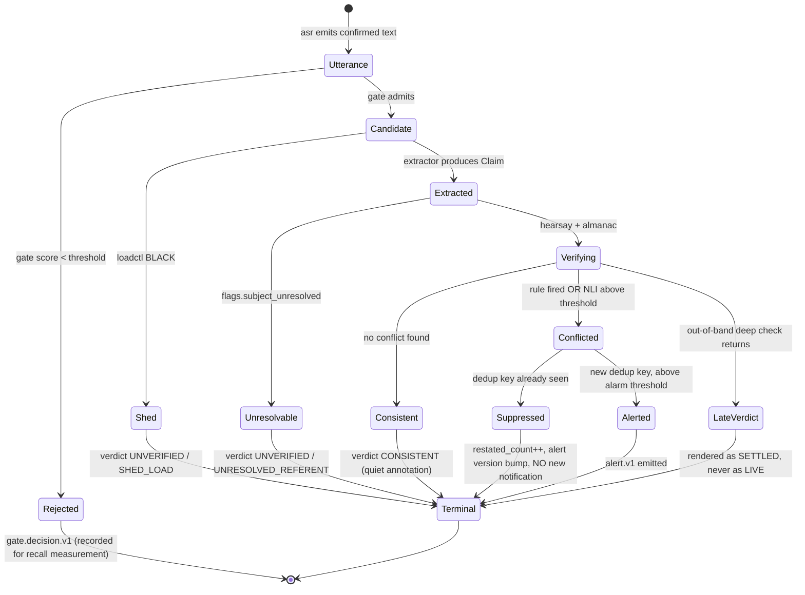

# Data contracts

**This file is the literal interface between the two of us.** It is co-owned: a change here
requires a PR approved by both, enforced by `CODEOWNERS` on `contracts/`, and validated by a
BACKWARD compatibility check against the Redpanda Schema Registry in CI. See
[ADR-021](01-DECISIONS.md#adr-021-two-people-one-co-owned-interface).

The Python source of truth is `contracts/` (Pydantic v2 models). JSON Schema is generated from
it, registered, and committed. **This document and the code cannot disagree** — a CI job
regenerates the schema and fails on a diff.

---

## Envelope — on every record

Every event on every topic carries these fields. Producers set them; consumers may rely on
them.

```python
class Envelope(BaseModel):
    schema_version: int          # bumped on breaking change; registry enforces BACKWARD
    event_id: ULID               # unique per record; the idempotency key for consumers
    run_id: str                  # ★ live run or replay run — see ADR-017
    session_id: str              # ★ the partition key on every topic
    mode: SessionMode            # INTERVIEW | BROADCAST | COMPLIANCE — purpose limitation
    media_time_ms: int           # ★ EVENT TIME: position in the session audio
    ingest_ts: datetime          # PROCESSING TIME: wall clock. Never used for logic.
    producer: str                # service name + semver, e.g. "extractor@0.4.1"
```

**Kafka headers** (not payload fields, so a consumer can filter without deserialising):

| Header | Purpose |
|---|---|
| `run_id` | Run isolation. Consumers filter on this **before committing offsets**. |
| `traceparent` | W3C trace context, so one OTel trace spans the whole pipeline across the broker. |
| `schema_id` | Registry id for the payload. |

### The two clocks

| Field | Clock | Used for |
|---|---|---|
| `media_time_ms` | **Event time.** Milliseconds from session start. | All logic. Ordering, windows, "did this come before that", the watermark. **Identical across replays.** |
| `ingest_ts` / `decided_ts` | **Processing time.** Wall clock. | Latency measurement only. |

**No stage may call `datetime.now()` for logic.** Clocks are injected. There is a lint rule in
CI, because this will otherwise be violated within a fortnight and replay will silently stop
being reproducible. See [ADR-017](01-DECISIONS.md#adr-017-replay-is-the-evaluation-primitive).

---

## Topics

| Topic | Key | Partitions | Cleanup | Retention | Producer | Consumers |
|---|---|---|---|---|---|---|
| `blah.utterance.v1` | `session_id` | 6 | delete | 7 d | `asr` | `gate`, `api`, `archiver` |
| `blah.gate.decision.v1` | `session_id` | 6 | delete | 7 d | `gate` | `archiver` |
| `blah.candidate.v1` | `session_id` | 6 | delete | 24 h | `gate` | `extractor` |
| `blah.claim.v1` | `session_id` | 6 | delete | 7 d | `extractor` | `hearsay`, `almanac`, `archiver` |
| `blah.verdict.v1` | `session_id` | 6 | delete | 7 d | `hearsay`, `almanac` | `alerter`, `api`, `archiver` |
| `blah.alert.v1` | `alert_id` | 6 | **compact** | infinite | `alerter` | `api`, `archiver` |
| `blah.load.level.v1` | `"global"` | 1 | delete | 7 d | `loadctl` | `gate`, `extractor`, `almanac` |

Keyed by `session_id` because **contradiction detection is session-scoped** — the session is
the natural unit of both ordering and parallelism. `blah.alert.v1` is keyed by `alert_id` and
compacted because an alert has genuinely mutable state; everything else is immutable.
See [ADR-008](01-DECISIONS.md#adr-008-keys-partitions-ordering-and-run-isolation).

---

## Session manifest — and the consent gate

A session **cannot be created without this.** Invalid or missing → HTTP 422 and **no audio is
written to disk at all**. There is no bypass flag.

```python
class Consent(BaseModel):
    obtained: Literal[True]                      # ★ Literal[True] — False is unrepresentable
    method: ConsentMethod                        # WRITTEN | VERBAL_RECORDED | IMPLIED_PUBLIC_BROADCAST
    jurisdiction: str                            # ISO 3166-1 alpha-2
    obtained_at: datetime
    obtained_by: str                             # operator identity, for the audit log
    subject_informed_of_automated_processing: Literal[True]   # GDPR Art. 13(2)(f)
    reference: str | None = None                 # pointer to the signed form; the form is NOT stored here
    retention_days: int = Field(default=30, ge=1, le=365)

class SessionManifest(BaseModel):
    session_id: str
    mode: SessionMode
    consent: Consent                             # ★ required, not Optional
    source: AudioSource                          # FILE | MIC | STREAM + locator
    reference_docs: list[ReferenceDoc] = []      # CV, fact sheet — ingested as REFERENCE_DOC claims
    expected_speakers: int = Field(default=2, ge=1, le=6)
    locale: Literal["en"] = "en"
```

`consent.obtained: Literal[True]` is deliberate: **a session with `obtained=False` does not
type-check and cannot be constructed.** The ethics constraint is enforced by the type system,
not by a runtime check someone can comment out. This is 40 lines of code and it is the most
persuasive artifact in the repository. See
[ADR-015](01-DECISIONS.md#adr-015-consent-pii-and-retention--as-code-not-as-a-paragraph).

---

## `Utterance` — the output of ASR

```python
class Word(BaseModel):
    w: str
    t0_ms: int                   # media time
    t1_ms: int
    conf: float = Field(ge=0, le=1)

class Utterance(Envelope):
    utterance_id: ULID
    speaker_id: str              # "SPEAKER_00" — a diarization CLUSTER, never an identity
    speaker_stability: float     # ★ confidence the cluster assignment is stable; see failure mode 7
    text: str                    # confirmed text only (LocalAgreement-2)
    words: list[Word]            # word timings — the UI's play button depends on these
    media_start_ms: int
    media_end_ms: int            # ★ the zero point for the latency budget
    asr_confidence: float        # aggregate over words
    cut_reason: CutReason        # SILENCE | PUNCTUATION | MAX_DURATION | SPEAKER_CHANGE
    asr_model: str               # version-pinned, recorded — replay depends on it
    prev_utterance_id: ULID | None
    revises: ULID | None = None  # ★ a diarization correction is a NEW record revising an old one
```

**`revises` rather than mutation.** Speaker labels can change as clustering refines; an
utterance is never updated in place, because a stream of immutable facts is the only thing
replay can reproduce.

---

## `Claim` — the canonical entity

**This is the heart of the system.** Everything upstream exists to produce it; everything
downstream consumes it.

```python
class CanonicalForm(BaseModel):
    """Deterministic, normalised. NEVER produced by an LLM — claim_fingerprint depends on it."""
    subject: str                 # resolved entity, e.g. "speaker" | "Acme Corp"
    predicate: str               # lemmatised, e.g. "operate"
    object: str | None           # e.g. "kafka"
    value: Decimal | None        # normalised number: "about four" -> 4
    value_range: tuple[Decimal, Decimal] | None   # ★ "about four" -> (3.5, 4.5); hedges are ranges
    unit: str | None             # SI-normalised where possible: "years"
    polarity: Literal["POS", "NEG"]               # ★ "never operated" -> NEG
    modality: Modality           # ASSERTED | HEDGED | REPORTED | HYPOTHETICAL | PREDICTED
    time_scope: TimeScope | None # absolute where resolvable, else relative

class Claim(Envelope):
    claim_id: ULID                        # ★ THIS utterance of this claim
    claim_fingerprint: str                # ★ sha256(canonical) — "same assertion?"
    origin: ClaimOrigin                   # SPEECH | REFERENCE_DOC
    speaker_id: str
    source_utterance_ids: list[ULID]      # ★ may span several — see ADR-003
    media_start_ms: int
    media_end_ms: int
    text_verbatim: str                    # ★ exact words. The alert quotes THIS, never a paraphrase.
    canonical: CanonicalForm
    claim_type: ClaimType                 # EXPERIENCE | QUANTITY | EVENT | ATTRIBUTION | IDENTITY | OTHER
    check_worthiness: float = Field(ge=0, le=1)
    embedding: list[float] | None         # 384-dim MiniLM; stored in pgvector, not on the topic
    flags: ClaimFlags
    extraction: ExtractionMeta

class ClaimFlags(BaseModel):
    subject_unresolved: bool = False      # ★ extractor could not resolve a referent -> CANNOT ALERT
    low_asr_confidence: bool = False      # ★ -> severity downgraded one level
    hedged: bool = False                  # "I think", "roughly" -> downgraded
    negated: bool = False
    reported_speech: bool = False         # "he said that..." -> not the speaker's own claim

class ExtractionMeta(BaseModel):
    method: Literal["LLM", "RULE"]        # ★ the --no-llm delta is measurable because of this
    model: str | None                     # version-pinned
    prompt_version: str | None
    gate_model_version: str
    confidence: float
    latency_ms: int
```

### The three identifiers, and why they are three

Conflating these is *the* bug in this class of system.

| Identifier | Scope | Answers | Two restatements of the same thing |
|---|---|---|---|
| `claim_id` | One extraction event | *Which moment in the audio?* | **Different** |
| `claim_fingerprint` | One assertion | *Is this the same claim?* | **Same** |
| `alert_dedup_key` | One conflict | *Have we already said this?* | **Same** |

```
claim_fingerprint = sha256(
    f"{subject}|{predicate}|{object}|{value or value_range}|{unit}|{polarity}|{time_scope}"
    .lower()
)

alert_dedup_key   = sha256(f"{session_id}|{min(fp_a, fp_b)}|{max(fp_a, fp_b)}|{verifier}")
alert_id          = uuid5(BLAH_NAMESPACE, alert_dedup_key)     # ★ deterministic
```

`alert_id` is deterministic, so reprocessing the same input produces the same id and the
compacted topic collapses duplicates by construction. **Idempotency falls out of key design
rather than being enforced by a lock.** The sorted fingerprint pair means A-vs-B and B-vs-A
collide automatically. See
[ADR-011](01-DECISIONS.md#adr-011-claim-identity-and-idempotent-alerting).

### Claim lifecycle



**Every path ends at `Terminal`, and `Terminal` always means a `verdict` record exists.** This
is the invariant behind **SLO-4**:

```
count(admitted candidates) == count(terminal verdicts)     -- per session, always
```

Asserted in CI, monitored at runtime, and it is the check that catches every silent-drop bug
this architecture could develop. **Nothing is ever dropped without a record saying so.**

---

## `Verdict`

```python
class Evidence(BaseModel):
    kind: Literal["PRIOR_CLAIM", "DOC_SPAN", "ALMANAC_ROW"]
    ref: str                     # claim_id | doc span id | almanac row id
    quote: str                   # ★ verbatim. An alert with no visible evidence is not shipped.
    media_time_ms: int | None    # so the UI can offer "play this"
    source_url: str | None
    source_tier: SourceTier | None            # T_PRIMARY | T_REFERENCE | T_WEAK
    as_of: date | None           # ★ what the source said THEN
    score: float

class Verdict(Envelope):
    verdict_id: ULID
    claim_id: ULID
    verifier: Verifier                        # HEARSAY_INTERNAL | HEARSAY_DOC | ALMANAC
    verifier_version: str
    status: VerdictStatus                     # the closed enum below
    reason_code: ReasonCode | None            # required iff status == UNVERIFIED
    confidence: float = Field(ge=0, le=1)
    evidence: list[Evidence]                  # ★ non-empty for any CONTRADICTED_* status
    detector: Literal["RULE_A", "NLI_B", "BOTH"] | None
    claim_media_time_ms: int
    decided_ts: datetime
    verdict_lag_ms: int                       # ★ SLO-3
    is_terminal: bool                         # exactly one terminal verdict per claim
```

### The closed vocabulary

```python
class VerdictStatus(StrEnum):
    CONSISTENT             = "CONSISTENT"
    CONTRADICTED_INTERNAL  = "CONTRADICTED_INTERNAL"      # Mode A only, may alert
    CONTRADICTED_BY_DOC    = "CONTRADICTED_BY_DOC"        # Mode A only, may alert
    CONTRADICTED_BY_SOURCE = "CONTRADICTED_BY_SOURCE"     # Mode B only, ANNOTATION CEILING
    DISPUTED               = "DISPUTED"                   # sources disagree; we do not adjudicate
    UNVERIFIED             = "UNVERIFIED"                 # + reason_code
    OUT_OF_SCOPE           = "OUT_OF_SCOPE"
    # ★ There is no FALSE. There is no LIE. The type system will not let us say it.

class ReasonCode(StrEnum):
    SHED_LOAD = "SHED_LOAD"; UNRESOLVED_REFERENT = "UNRESOLVED_REFERENT"
    LOW_ASR_CONFIDENCE = "LOW_ASR_CONFIDENCE"; NO_REFERENCE_COVERAGE = "NO_REFERENCE_COVERAGE"
    EXTRACTION_FAILED = "EXTRACTION_FAILED"; BELOW_THRESHOLD = "BELOW_THRESHOLD"
```

The absence of `FALSE` is the defamation control, and it lives in the type system rather than
in a style guide. A dbt `accepted_values` test on `fct_verdict.status` enforces it a second
time at the warehouse boundary: **if anyone ever emits it, the build fails.** See
[ADR-014](01-DECISIONS.md#adr-014-the-confidence-vocabulary-and-what-is-allowed-to-alarm).

---

## `Alert`

```python
class Alert(Envelope):
    alert_id: UUID                   # ★ deterministic = uuid5(ns, dedup_key)
    dedup_key: str
    version: int                     # bumped on restatement or confidence upgrade
    severity: Literal["ALERT", "ANNOTATION"]
    confidence_band: Literal["HIGH", "MEDIUM", "LOW"]
    claim_ids: list[ULID]            # the claims involved (usually two)
    verdict_ids: list[ULID]
    restated_count: int = 1          # ★ increments; does NOT produce a new notification
    headline: str                    # TEMPLATED. Never free-form LLM text.
    evidence: list[Evidence]         # both verbatim quotes + timestamps
    presentation_band: Literal["LIVE", "SETTLED", "ARCHIVAL"]   # by verdict_lag_ms
    first_emitted_ts: datetime
    last_updated_ts: datetime
    suppressed_until_ts: datetime | None

    # ★ THERE IS DELIBERATELY NO FIELD FOR:
    #   - a candidate score, rating, or ranking
    #   - an aggregate consistency index
    #   - a hiring recommendation
    # See ADR-016. Adding one is a contracts/ PR requiring both owners' approval.
```

**The absent fields are a load-bearing part of the design.** Interview mode emits prompts for
a human, never assessments, because ASR word error rates differ by roughly 2x across
demographic groups and an automated screening score built on that is a discrimination engine.
A downstream consumer wanting to build one would have to extend this schema through a
two-person review — which is exactly the friction we want on that change.

Headlines are templated:

```
"Possible conflict — at {t1} the speaker said {quote1}; at {t2} they said {quote2}."
```

Attributive, quoting, stating what was *said* rather than what is *true*. That is the legal
posture, and it is why phrasing is a template rather than a generation.

---

## Storage layering

| Layer | Tech | Grain | Retention | Why this layer |
|---|---|---|---|---|
| **Hot** | Postgres + `pgvector` | Current session | `consent.retention_days` | Concurrent readers/writers, transactional dedup, sub-30 ms kNN over n < 2,000 vectors. **A vector database would be unjustified at this n** — an IVFFlat index is milliseconds. |
| **Lake** | Parquet on MinIO | Every record, every run | 90 d, or `retention_days` if shorter | Immutable, columnar, cheap, the replay source. Partitioned `mode=/dt=/session_id=`. |
| **Marts** | dbt on DuckDB | Dimensional | Rebuildable | Aggregates across runs and sessions: the CI quality gate, the fairness gate, threshold tuning. |

### Partitioning, and why it is shaped that way

```
s3://blah/lake/{topic}/mode={INTERVIEW|BROADCAST|COMPLIANCE}/dt={YYYY-MM-DD}/session_id={id}/*.parquet
```

Three levels, each for a concrete reason:

1. **`mode=` first** — enforces purpose limitation physically. Interview data and broadcast
   data live in different prefixes, and a dbt test rejects a cross-mode join. Claims about a
   private individual can never leak into a public-figure analysis.
2. **`dt=`** — the natural pruning dimension for every analytical query and for retention.
3. **`session_id=` last** — makes **GDPR erasure a partition drop rather than a rewrite.**
   This is the partitioning decision that matters most, and it was chosen for deletion, not
   for query performance.

**Small-file problem:** streaming writes produce many small Parquet files. A nightly
compaction job merges per partition. A real lakehouse problem, solved deliberately rather than
discovered in month four.

**Archiver idempotency:** deterministic filenames (`{topic}-{partition}-{start_offset}.parquet`)
plus write-to-temp-and-atomic-rename. A re-run overwrites identically rather than duplicating.

---

## PII handling

| Data | Classification | Control |
|---|---|---|
| Raw audio | **Personal data (voice)** | Object storage, retention-bounded, deleted on erase. Never in the repo. |
| Transcript text | **Personal data** | Retention-bounded. Deleted on erase. |
| `speaker_id` | **Pseudonym** | A diarization cluster label. Never an identity. |
| Real name ↔ cluster mapping | **Identifying** | Optional, operator-supplied, written to the append-only `audit_log`. **Nothing in the pipeline requires it to function.** |
| Claims | **Personal data** (assertions about a person) | Retention-bounded, mode-partitioned, deleted on erase. |
| Consent manifest | **Record of processing** | Retained beyond deletion as the lawful-basis record. Contains no claim content. |
| `audit_log` | **Record of processing** | Append-only, excluded from erasure (it records *that* erasure happened). Identifiers and actions only. |

**Erasure is real deletion, not a flag:**

```bash
blah subject erase --session S-2026-09-14-001 --reason "Art. 17 request"
```

Deletes audio (MinIO), transcripts/claims/alerts (Postgres), lake partitions (partition drop),
and triggers a mart rebuild. Writes a tombstone to `audit_log`. **There is a test asserting
that after erase, a full-text search across every store returns nothing** — soft deletes do
not satisfy an erasure request and we do not pretend otherwise.

```bash
blah subject export --session S-2026-09-14-001   # Art. 15 subject access
```

---

## Schema evolution

**Rules:**

1. **Additive only within a major version.** New fields must be optional with a default.
2. **Never repurpose a field name.** Add a new one, deprecate the old.
3. **Never remove an enum value** without a major bump — a consumer will have it persisted.
4. **Adding an enum value is a minor change for producers and a breaking change for
   consumers.** Consumers must handle unknown values by routing to `OUT_OF_SCOPE` and emitting
   a metric, never by raising.
5. **Breaking change = new topic** (`blah.claim.v2`), dual-write, migrate consumers, retire.

**Enforced in three independent places**, which is roughly the right friction for the most
dangerous class of change in the system:

| Where | What it catches |
|---|---|
| Redpanda Schema Registry, BACKWARD compatibility check in CI | An incompatible schema reaching the broker |
| Contract tests — every fake and every real implementation run the same suite | An implementation drifting from the schema |
| `CODEOWNERS` on `contracts/` requiring **both** approvals | A change neither of us discussed |

---

## The interfaces that let us work in parallel

The reason two people on different evenings do not block each other. Every one has a fake that
passes the same contract test suite as the real implementation.

```python
class ASRStage(Protocol):
    def start(self, session: SessionManifest) -> None: ...
    def feed(self, pcm: bytes, media_time_ms: int) -> None: ...
    def utterances(self) -> Iterator[Utterance]: ...
    # FakeASR replays a stored transcript with ORIGINAL timings.
    # B builds the entire deployment + observability + chaos story against this
    # while A is still choosing a Whisper model.

class Extractor(Protocol):
    def extract(self, window: list[Utterance], registry: EntityRegistry) -> list[Claim]: ...

class Verifier(Protocol):
    name: str
    version: str
    def verify(self, claim: Claim, ctx: SessionContext) -> list[Verdict]: ...
    # ★ Defined in M0, before either real implementation exists.
    # Both HearsayVerifier and AlmanacVerifier satisfy it — this is the
    # "one spine, two verifiers" claim made concrete and testable. See ADR-001.
```

**`make test-contracts` runs the full suite against fakes and reals alike.** A fake that has
rotted fails CI, which is what keeps parallel work honest over months rather than weeks.
