# Roadmap

Milestones, not weeks. **Every milestone is independently demo-able** — we can stop after any
one of them and still have something honest to show. That is the design constraint, because the
most likely failure mode for an evenings-and-weekends project by two unemployed engineers is not
technical, it is running out of energy in month four with a half-built thing.

**A** = data engineer. **B** = DevOps engineer. **AB** = co-owned, both approvals required.

| | Milestone | Demo-able as | Est. effort |
|---|---|---|---|
| **M0** | The spine, with no intelligence in it | A working contradiction-detection system with zero ML | ~4-6 evenings each |
| **M1** | Real ears | Live transcription with measured latency and measured WER | ~4-6 each |
| **M2** | Real claims | Structured claims from real speech, with a published gate P/R | ~6-8 each |
| **M3** | Real contradictions, honest alerts | **The actual product.** The 3-minute demo works. | ~6-8 each |
| **M4** | Warehouse and evaluation | Precision-by-version dashboard; CI blocks a regression | ~5-7 each |
| **M5** | Production posture | Chaos demo; autoscaling; SLOs; game day | ~5-7 each |
| **M6** | The second verifier | Broadcast mode, bounded and honest | ~5-7 each |

Effort figures are **guesses by people who have not built this before** and should be read as
ordering, not as schedule.

---

## M0 — The spine, with no intelligence in it

> **The most important milestone, and the one most projects skip.** M0 contains no ML
> whatsoever. `FakeASR` replays a stored transcript with original timings; `RuleVerifier`
> detects one hardcoded class of contradiction. Everything else — contracts, log, replay, diff,
> consent gate, metrics, CI — is **real and final**.
>
> This is deliberate. It de-risks the entire project: if M0 works, every later milestone is
> swapping a fake for a real implementation behind a contract-tested interface. It also means
> **B is never blocked waiting for a model**, which is the single biggest threat to two people
> working in parallel.

**Goal.** A session flows end to end through real infrastructure and produces a real, correct
alert — with no model anywhere in the system.

### Done means

Every line is checkable, and `make verify-m0` runs all of them:

- [ ] `git clone && make demo` on a clean machine with **no GPU, no accounts, no model
      downloads** plays `fixtures/sessions/mock-interview-01` end to end.
- [ ] The UI shows a live transcript and raises **exactly one alert**, containing **both
      verbatim quotes with timestamps**, within **4 s** of the contradicting utterance's
      `media_end`.
- [ ] Restating the contradicting claim twice more produces **no new alert** and
      `restated_count == 3`.
- [ ] A session with a missing or invalid `consent` block is **rejected with HTTP 422 and no
      audio is written to disk.** (`make test-consent-gate`)
- [ ] `make replay && make diff` re-runs the session under a new `run_id` and reports
      **zero differences**.
- [ ] `make chaos-kill-fake-asr` kills the stage mid-session; it restarts, resumes from its
      committed offset, and **SLO-4 reconciliation confirms zero claim loss.**
- [ ] Grafana shows per-stage latency, consumer lag, and the end-to-end `verdict_lag_ms`
      histogram.
- [ ] CI is green: lint, types, unit, **contract tests against both fakes and reals**,
      **schema-registry BACKWARD check**, integration, and the **no-wall-clock lint rule**.

### What a reviewer can see

A browser window with a transcript scrolling, an alert card appearing with two quotes and two
timestamps, a Grafana dashboard with a latency histogram, and a terminal where a container is
killed and nothing is lost. **They will not be able to tell from the UI that there is no ML in
it** — which is precisely the point being made.

### Who does what

| A (data engineer) | B (DevOps engineer) |
|---|---|
| `contracts/` — all schemas, enums, `Protocol`s **(AB)** | `contracts/` review **(AB)** |
| `FakeASR` + the fixture transcript format | Redpanda + Schema Registry + topic provisioning |
| `RuleVerifier` — numeric + polarity contradiction | Docker Compose, `make` targets, `make demo` |
| Canonicalisation + `claim_fingerprint` + unit tests | Postgres + migrations (Alembic) |
| `alerter` — dedup, suppression, versioning | `ingest` + **the consent gate** |
| `fixtures/sessions/mock-interview-01` (scripted, recorded) | `api` + SSE + the minimal UI |
| | Replay harness + `blah diff` |
| | Prometheus + Grafana + OTel + the no-wall-clock lint rule |
| | GitHub Actions: the full gate chain |

**Blocking point (the only one in M0): `contracts/` must land first.** Mitigation: it is day
one, it is a pairing session, and it is the one thing we write together in the same room (or
call). Everything after it is parallel.

---

## M1 — Real ears

**Goal.** Replace `FakeASR` with real streaming ASR. Measure it honestly. Discover whether the
latency budget survives contact with reality.

### Done means

- [ ] `ASR_IMPL=faster_whisper` transcribes a live microphone and a file; `ASR_IMPL=fake` still
      works and **both pass the identical contract test suite.**
- [ ] `docs/reports/asr-latency-YYYY-MM-DD.md` is **committed to the repo**, giving measured p50
      and p95 `asr_confirm_latency_ms` on both the GPU and CPU profiles.
- [ ] **[ADR-006](01-DECISIONS.md#adr-006-the-latency-budget) is updated with the measured
      number.** If ASR is slower than the 1,200 ms estimate, the published end-to-end target is
      revised upward and the revision is visible in git history.
- [ ] WER is measured against fixture transcripts and reported **per profile and per accent
      group present in the set**, with the set's actual composition stated.
- [ ] `flags.low_asr_confidence` is set and demonstrably downgrades alert severity.
- [ ] Word-level timings drive a working "click a quote, hear the audio" button.
- [ ] CI still runs CPU-only and still passes.

### What a reviewer can see

Live transcription from a microphone. A committed latency report with real numbers — **including
the ones that missed the target.** A fairness measurement that exists before anyone asked for it.

### Who does what

| A | B |
|---|---|
| `asr` service: faster-whisper + Silero VAD + LocalAgreement-2 | GPU and CPU container profiles, CUDA base images |
| Utterance assembly + cut-reason logic | Model cache volumes (no re-download per run) |
| WER harness + accent-group slicing | OTel traces spanning ASR, context in Kafka headers |
| The latency report | ASR readiness probe accounting for **model warm-up** |
| | Load generator: replay a session at N× real time |

**Blocking point:** none. B works entirely against `FakeASR` until A's implementation passes the
contract suite, then swaps an env var.

---

## M2 — Real claims

**Goal.** Turn utterances into structured, canonical, fingerprinted `Claim` records. Publish the
gate's precision and recall.

### Done means

- [ ] Gate trained on ClaimBuster; **P/R published on a held-out ClaimBuster split *and*
      separately on our own G2 set** — the two numbers reported separately, never the better one
      quoted as if it were both.
- [ ] Extraction produces schema-valid `Claim` records via JSON-schema-constrained decoding;
      **structural validity is 100% by construction.**
- [ ] **`--no-llm` mode works and is tested in CI on every commit**, extracting
      numeric/temporal/polarity claims by rule.
- [ ] `docs/reports/extraction-YYYY-MM-DD.md` publishes the **measured LLM vs `--no-llm`
      delta** — claims recovered, precision of each.
- [ ] `flags.subject_unresolved` rate is measured and on a dashboard.
- [ ] Canonicalisation has a unit-test table of tricky cases: *"about four"*, *"a couple"*,
      *"never"*, *"not really"*, *"18 months"* vs *"a year and a half"*.
- [ ] Measured `extract_latency_ms` p95 updated in [ADR-006](01-DECISIONS.md#adr-006-the-latency-budget).

### What a reviewer can see

A live claim feed beside the transcript: verbatim text on the left, canonical structured form on
the right. A published number for what the LLM actually buys over rules — **a measurement almost
no portfolio project makes.**

### Who does what

| A | B |
|---|---|
| Gate: rules + ClaimBuster classifier + training script | Ollama container + model pinning + VRAM budget |
| `extractor`: windowed prompt, constrained decoding, entity registry | `archiver`: topics → Parquet, idempotent writes |
| Canonicalisation + fingerprinting | MinIO + lake partition layout |
| `--no-llm` rule extractor | Lag-based scaling prototype (pre-KEDA) |
| Extraction report | Small-file compaction job |

**Blocking point:** A needs Ollama running. Mitigated by B delivering it early in M2 and by a
`FakeExtractor` that returns fixture claims.

---

## M3 — Real contradictions, honest alerts

> **This is the product.** After M3 the three-minute demo works and the project is complete as a
> portfolio piece. Everything after M3 makes it more credible, not more functional.

**Goal.** The `hearsay` engine: rules → kNN retrieval → NLI rescoring, with the full confidence
vocabulary and honest UI.

### Done means

- [ ] `hearsay` implements the `Verifier` protocol; `FakeVerifier` and `AlmanacVerifier` (stub)
      satisfy the same suite — **"one spine, two verifiers" is now a passing test, not a claim.**
- [ ] On **G2-held-out** (written by one of us, never read by the other):
      **alert precision ≥ 0.90**, with recall reported honestly alongside it, at the chosen
      threshold — and **the chosen threshold and what it bought are published.**
- [ ] Planted near-misses (hard negatives) **do not alert.**
- [ ] The UI distinguishes four states: **alert**, **annotation**, **checked-clear**, and
      **not checked (with reason)** — visibly, at a glance.
- [ ] Every alert shows both verbatim quotes, both timestamps, and both audio play buttons.
      **No evidence, no alert.**
- [ ] Severity downgrade demonstrably fires on `low_asr_confidence`, `subject_unresolved` and
      `hedged`.
- [ ] `make demo` performs the full 3-minute script in
      [`07-DEMO-AND-INTERVIEW.md`](07-DEMO-AND-INTERVIEW.md).

### What a reviewer can see

**The demo.** Someone contradicts themselves and the system catches it in under four seconds,
shows both quotes, plays both clips, and refuses to alarm on the near-miss two minutes later.

### Who does what

| A | B |
|---|---|
| Stage A deterministic contradiction rules | k3d cluster, Kustomize base + 3 overlays |
| kNN retrieval over `pgvector` | Probes, resource limits, PodDisruptionBudgets |
| NLI rescoring + threshold calibration on G2-dev | Chaos harness: `make chaos-*` |
| G2 gold set: ~20 scripted recordings + labels | Alert-rate limiting + UI degradation banners |
| Confidence vocabulary + downgrade rules | Audio serving with byte-range seek |

**Blocking point:** the G2 gold set gates threshold calibration. Mitigation: A starts recording
G2 during **M1**, not M3. Put it in the backlog now.

---

## M4 — Warehouse and evaluation

**Goal.** Make "did this change make it better?" a question with a numeric answer that blocks a
merge.

### Done means

- [ ] dbt project builds `dim_*`, `fct_*` and the marts from Parquet via DuckDB.
- [ ] **dbt tests pass, including `accepted_values` on `fct_verdict.status`** — the second,
      independent enforcement that `FALSE` can never be emitted.
- [ ] `blah diff RUN_A RUN_B` produces a report: verdicts changed, alerts gained/lost,
      precision/recall delta, per-stage latency delta.
- [ ] **CI quality gate: a PR that drops held-out alert precision below 0.90 fails the build.**
- [ ] **CI fairness gate: `max_group_wer / min_group_wer ≤ 1.5` or the build fails.** *(We expect
      to fail this first. That is the point of having it.)*
- [ ] `blah warehouse backfill --from --to` rebuilds marts from the lake.
- [ ] `blah subject erase` deletes across Postgres, lake partitions and marts, and **a test
      asserts a full-text search over every store then returns nothing.**
- [ ] Grafana: precision by pipeline version over time.

### What a reviewer can see

A dashboard of alert precision by pipeline version. A failing CI run on a PR that made quality
worse. A fairness gate with a real number. **This milestone is what separates the project from a
demo.**

### Who does what

| A | B |
|---|---|
| dbt models: dims, facts, marts, tests | Backfill + compaction + retention jobs |
| `blah diff` and the metric definitions | The job wrapper: retry, backoff, idempotency, alerting |
| Eval harness + gold-set tooling | CI gates wired to the marts |
| `dim_almanac_source` SCD2 modelling | `blah subject export` / `erase` + the deletion test |

**Blocking point:** B's archiver must be writing Parquet before A can build models. It has been
since M2. No new block.

---

## M5 — Production posture

**Goal.** Make the operational story the demo, not the packaging.

### Done means

- [ ] All five SLOs defined, instrumented, and on a dashboard with burn-rate alerts.
- [ ] **KEDA scales `extractor` and `hearsay` on consumer-group lag**, demonstrated live.
- [ ] All six `make chaos-*` injections run, each with a runbook entry and an **asserted expected
      behaviour**, not just an observed one.
- [ ] **Overload demo:** feed a session at 4×; `loadctl` walks GREEN→AMBER→RED→BLACK; the UI
      shows "not checked — system busy"; **SLO-4 conservation still holds** (every shed candidate
      has a terminal verdict).
- [ ] `docs/RUNBOOK.md` covers every failure mode in
      [`02-ARCHITECTURE.md`](02-ARCHITECTURE.md#failure-modes).
- [ ] **One game day completed and written up**: one of us breaks something without telling the
      other; the other diagnoses it from dashboards alone. The write-up is committed, including
      what the dashboards failed to show.

### What a reviewer can see

A terminal killing a pod while a session runs, lag spiking, pods scaling, recovery, and a
reconciliation counter proving nothing was lost. **A committed game-day write-up is an unusual
and very strong artifact for a junior portfolio.**

### Who does what

| A | B |
|---|---|
| SLO metric definitions + the SLO-4 reconciliation job | KEDA ScaledObjects + scaling demo |
| `loadctl` shedding policy + priority function | Burn-rate alert rules |
| Load-level events on the log | Chaos harness completion + toxiproxy latency injection |
| | `RUNBOOK.md`, game day facilitation and write-up |

---

## M6 — The second verifier

**Goal.** Prove the spine is a spine by hanging a genuinely different verifier off it — and keep
it bounded and honest.

### Done means

- [ ] `AlmanacVerifier` satisfies the **same `Verifier` protocol**, swapped by config.
- [ ] Almanac build job produces a versioned, frozen corpus with `source_url`, `source_tier`,
      `as_of` and SCD2 validity on every row.
- [ ] On a broadcast fixture: `CONTRADICTED_BY_SOURCE` **with a citation and `as_of` date** for
      seeded claims; `UNVERIFIED / NO_REFERENCE_COVERAGE` for everything outside the corpus.
- [ ] **Almanac hit rate is published as a metric.** Low coverage is reported honestly, not
      hidden.
- [ ] **A test asserts that no verdict with status `CONTRADICTED_BY_SOURCE` can ever have
      `severity == ALERT`** — the annotation ceiling is enforced in code.
- [ ] Conflicting sources produce `DISPUTED` with both shown.
- [ ] `almanac_version` on every verdict; replay against two Almanac versions diffs cleanly.

### What a reviewer can see

The same pipeline, one config change, verifying against the world instead of against itself —
**and saying "unverified" honestly most of the time**, which is the intellectually honest
outcome and the one Squash's post-mortem predicts.

---

## The cut list

**Ordered.** When energy runs out, cut from the top. Each line states what is lost and what
survives.

| # | Cut | What is lost | What survives |
|---|---|---|---|
| 1 | **M6 entirely** (external verification) | The "two modes" story | Everything. The `Verifier` protocol with a fake second implementation still proves the spine. **Say "we scoped it out and here is why" — that is a stronger answer than a bad broadcast mode.** |
| 2 | **MinIO** → a Docker volume | The "swap to S3" line | Everything. ~10 lines behind the same interface. |
| 3 | **Jaeger / distributed tracing** | The prettiest ops artifact | Prometheus metrics still give per-stage latency. |
| 4 | **KEDA autoscaling** | One strong DevOps talking point | `loadctl` shedding still fully answers backpressure. |
| 5 | **k3d / Kubernetes entirely** | The orchestration story | Compose runs everything. **Cut this only if B has k8s elsewhere on their CV** — it is B's headline artifact, which is why it is this far down. |
| 6 | **NLI Stage B** | Recall on non-numeric contradictions | Stage A rules. Precision goes *up*. "We removed the neural component because the rules were better" is a good sentence. |
| 7 | **dbt** → three SQL scripts | Lineage, tests, docs site | The gates still work. |
| 8 | **The LLM** (`--no-llm` permanently) | Most non-numeric claim extraction | A deterministic, fully reproducible, honest system. **The floor is still a working product.** |

**Never cut, in any circumstance:** the consent gate, the contracts package, replay + diff, the
gold set, the closed verdict vocabulary, or the fairness measurement. Those six are the project's
integrity, and a version without them is a tutorial.

---

## Parallel tracks and blocking points

```mermaid
gantt
    dateFormat X
    axisFormat M%L
    title Two tracks, with the four blocking points marked
    section A — data
    contracts (PAIRED)        :crit, a0, 0, 1
    fake ASR + rule verifier  :a1, 1, 2
    real ASR + WER            :a2, 3, 2
    gate + extractor          :a3, 5, 2
    G2 gold set (start early!) :active, a35, 3, 4
    hearsay engine            :a4, 7, 2
    dbt + eval                :a5, 9, 2
    almanac                   :a6, 13, 2
    section B — platform
    contracts review (PAIRED) :crit, b0, 0, 1
    redpanda+compose+CI+replay :b1, 1, 2
    profiles + tracing        :b2, 3, 2
    ollama + archiver + lake  :b3, 5, 2
    k3d + chaos harness       :b4, 7, 2
    backfill + CI gates       :b5, 9, 2
    KEDA + SLOs + game day    :b6, 11, 2
```

**Only four genuine blocking points across the whole project:**

| # | Block | Mitigation |
|---|---|---|
| 1 | `contracts/` must exist before anything | **Day one, written together in one session.** The only true serialisation. |
| 2 | A needs Ollama running (M2) | B ships it early in M2; `FakeExtractor` unblocks A meanwhile. |
| 3 | B needs Parquet-shaped data (M4) | Archiver has been writing since M2. |
| 4 | Threshold calibration needs G2 (M3) | **A starts recording G2 in M1.** This is the one that will bite if ignored — it is slow, unglamorous work and it is easy to defer. |

**Everything else is unblocked by fakes.** That is the entire purpose of
[ADR-021](01-DECISIONS.md#adr-021-two-people-one-co-owned-interface): B builds the deployment,
observability and chaos story against `FakeASR` while A is still choosing a Whisper model, and
neither waits on the other.
